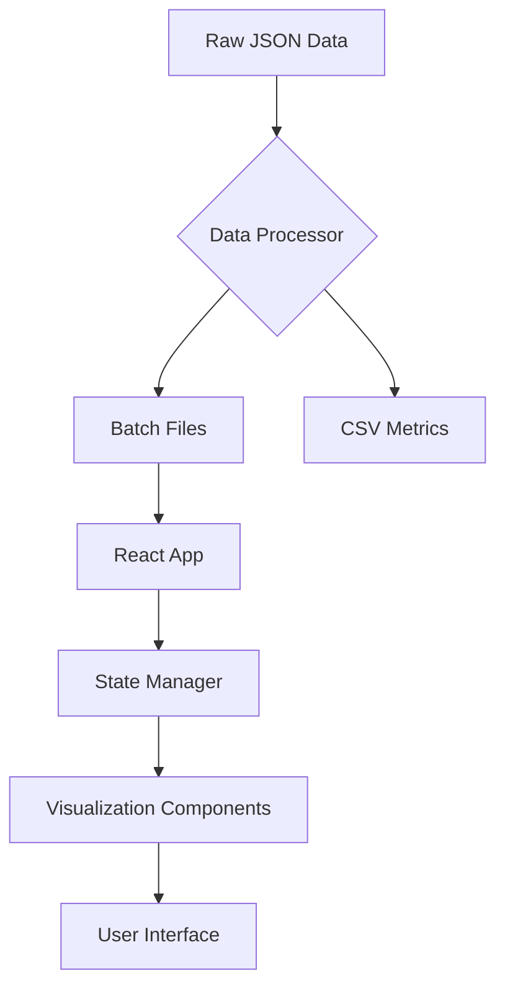

# Job Processing Environment Visualizer


A web-based visualization tool for analyzing job processing environments with interactive step-by-step execution details and machine allocation insights.


## Features

- 🕹️ Interactive step navigation with filtering capabilities
- 📊 Comprehensive analytics dashboard with reward progression charts
- 🖥️ Machine window visualization with job allocation tracking
- 📈 Real-time data processing for large JSON environment files
- 🔍 Detailed step inspection with agent positioning and job status

## Installation

### Prerequisites

- Node.js v18+
- npm v9+ or yarn v1.22+

```bash
# Clone repository
git clone https://github.com/nguyenlee97/job-processing-visualization.git
cd nguyenlee97-job-processing-visualization

# Install dependencies
npm install

# Process sample data (optional)
node public/data/process_json.cjs input.json 100 output
```

## Usage

### Development Mode

```bash
npm run dev
```

### Data Processing

Process large JSON environment files:

```bash
node public/data/process_json.cjs <input_file> <batch_size> <output_prefix>
```

## Key Functionality

### Step Navigation:
- Filter steps by type (Normal, Skip, Final, Terminated)
- Keyboard navigation with play/pause auto-stepping
- Batch-loaded step details for optimal performance

### Machine Visualization:
- Interactive machine window displays
- Real-time job allocation tracking
- Agent position highlighting

### Analytics Dashboard:
- Reward progression charts with zoom/pan
- Step type distribution graphs
- PDF export capability

## Configuration

### Environment Setup

Place JSON data files in `public/data/`

Update `vite.config.ts` for custom build settings

Environment variables:

```env
VITE_API_ENDPOINT=http://localhost:3000
VITE_MAX_STEPS=1000
```

### Data Processing Options

Configure through command-line arguments:

```bash
# Example: Process input.json with 500 steps per batch
node process_json.cjs input.json 500 processed_batch
```

## Project Structure

```
├── public/ # Static assets
│ └── data/ # Processed JSON and CSV files
├── src/
│ ├── components/ # React components
│ ├── context/ # State management
│ ├── types/ # TypeScript definitions
│ └── utils/ # Data processing utilities
└── vite.config.ts # Build configuration
```

## Core Modules

### 1. Data Processing Engine
- Stream-based JSON processing
- Chunked data loading
- CSV export for analytical data

### 2. Visualization Components
- MachineJobVisualization: Interactive machine grid
- AnalyticsDashboard: Reward charts and metrics
- StepNavigator: Timeline control system

### 3. State Management
- Context API for global state
- Filtered step caching
- Batch loading system

## Project Purpose

### Problem Solving

This tool addresses the challenge of understanding complex job processing environments by providing:
- Visual representation of machine allocations
- Temporal analysis of processing steps
- Debugging insights for scheduling algorithms

### Target Audience
- Scheduling algorithm developers
- Industrial automation engineers
- Reinforcement learning researchers
- Process optimization specialists

## Use Cases

### Algorithm Development:

```bash
# Visualize Q-learning agent's decisions
node process_json.cjs qlearning_steps.json 200 qlearn
```

### Process Optimization:
- Identify machine idle times
- Analyze job allocation efficiency

### Educational Tool:
- Demonstrate scheduling concepts
- Visualize constraint-based processing

## Architecture Overview



## Contributing

1. Fork the repository
2. Create feature branch (`git checkout -b feature/AmazingFeature`)
3. Commit changes (`git commit -m 'Add AmazingFeature'`)
4. Push to branch (`git push origin feature/AmazingFeature`)
5. Open Pull Request

## License

MIT License © 2023 Nguyen Lee
